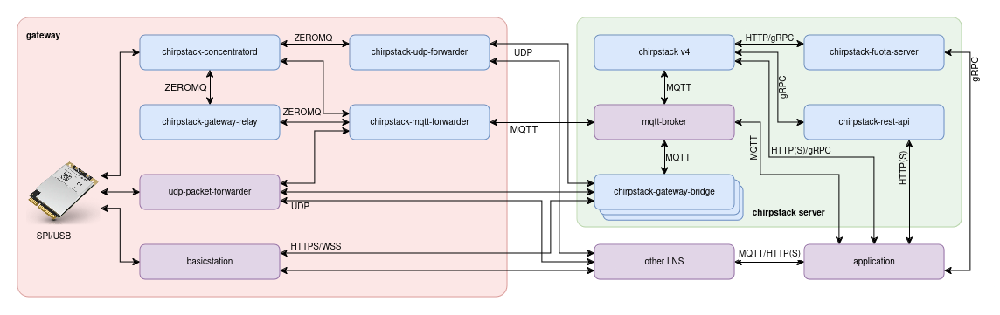

# ChirpStack MQTT Forwarder service for Docker

This is an **unofficial** built of the ChirpStack MQTT Forwarder service meant to be deployed using docker. The binaries included with this image are built using the chirpstack-mqtt-forwarder fork under https://github.com/xoseperez/chirpstack-mqtt-forwarder and may have small differences with the original binaries (check the repo for more info).

Please refer to the original sources of the project whenever possible, contribute and donate to Orne for his great work: https://github.com/chirpstack/chirpstack-mqtt-forwarder

ChirpStack MQTT Forwarder is an open-source LoRa(WAN) packet forwarder using MQTT as transport protocol, part of the ChirpStack project. It requires a chirpstack-concentratord component in order to build a viable LoRaWAN gateway solution.

## Chirpstack MQTT Forwarder service variables

These variables you can set them under the `environment` tag in the `docker-compose.yml` file or using an environment file (with the `env_file` tag). 

Variable Name | Value | Description | Default
--- | --- | --- | ---
**`LOGGING_LEVEL`** | `STRING` | One of `TRACE`, `DEBUG`, `INFO`, `WARN`, `ERROR` or `OFF` | `INFO`
**`MQTT_TOPIC_PREFIX`** | `STRING` | Topic prefix, defines the region of the gateway | `eu868`
**`MQTT_SERVER`** | `STRING` | MQTT broker address `<schema>://<domain or ip>:<port>` | `tcp://mosquitto:1883`
**`MQTT_USERNAME`** | `STRING` | MQTT broker user name | *empty*
**`MQTT_PASSWORD`** | `STRING` | MQTT broker user password | *empty*
**`MQTT_QOS`** | `0`, `1` or `2` | MQTT quality of service | `0`
**`MQTT_CA_CERT_PATH`** | `STRING` | Path to MQTT broker root certificate | *empty*
**`MQTT_CLIENT_CERT_PATH`** | `STRING` | Path to MQTT client certificate | *empty*
**`MQTT_CLIENT_KEY_PATH`** | `STRING` | Path to MQTT client key | *empty*
**`MQTT_JSON`** | `false` or `true` | Send messages using MQTT instead of Protobuf (only for debugging!) | `false`
**`BACKEND`** | `STRING` | Backend type, either `concentratord` or `semtech_udp` | `concentratord`
**`BACKEND_SOCKET_NAME`** | `STRING` | Prefix of the IPC socket when using `concentratord` backend | `concentratord`
**`BACKEND_UDP_BIND`** | `STRING` | Address to listen to UDP messages when using `semtech_udp` backend | `0.0.0.0:1700`
**`BACKEND_FILTER_DEVADDR`** | `STRING` | Allow only uplinks for specific DevAddr | *empty*
**`BACKEND_FILTER_JOINEUI`** | `STRING` | Allow only join request for specific Join EUIs | *empty*

## Use

Check the included `docker-compose.yml` file for a usage example.

## License

ChirpStack MQTT Forwarder is distributed under the MIT license (and so is this repository). See LICENSE.

